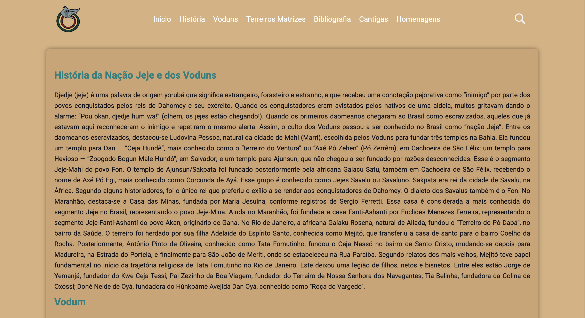
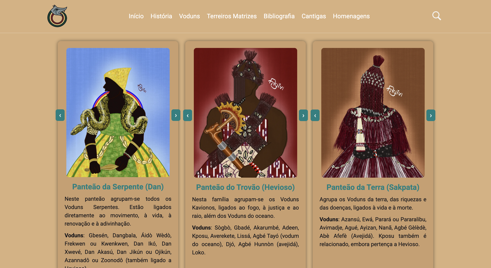
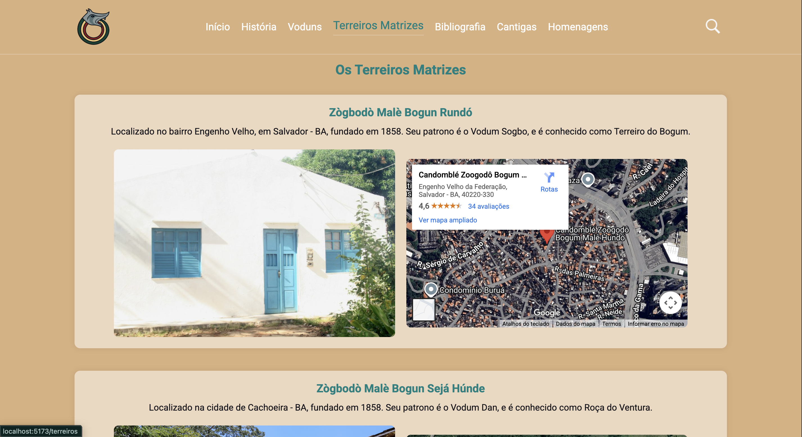
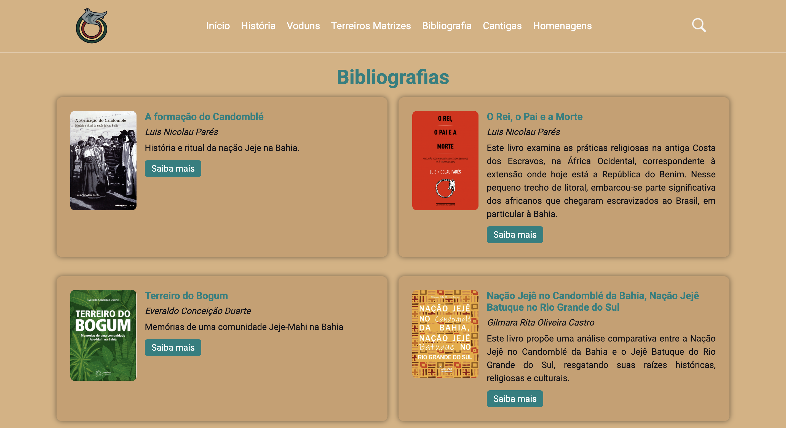
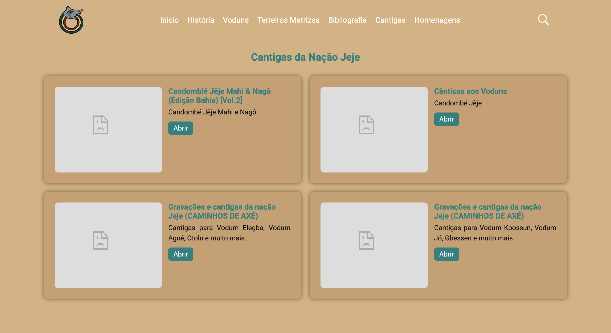
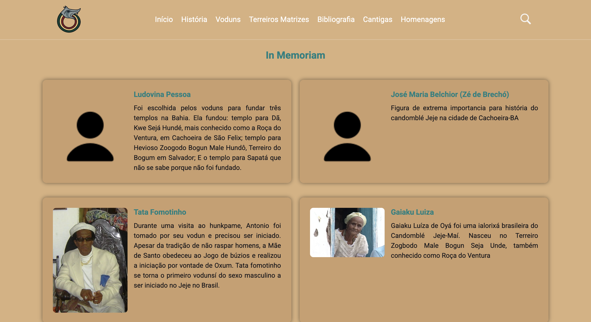

# 🌍 Site informativo sobre a nação Jeje-Mahi

Este projeto tem como objetivo reunir e divulgar informações sobre a história da nação Jeje-Mahi no Brasil, valorizando sua cultura, ancestralidade e contribuição para a formação da identidade afro-brasileira.

A proposta é oferecer uma plataforma acessível e visualmente agradável, onde visitantes possam aprender mais sobre os fundamentos, tradições e trajetórias do povo Jeje-Mahi.


## 🛠️ Tecnologias utilizadas

- **React + Vite**: estruturação e renderização da aplicação com alta performance
- **React Router DOM**: navegação entre páginas (Home, História, Voduns, Terreiros, Bibliografia, Cantigas, Homenagens)
- **CSS**: estilização responsiva e personalizada
- **JavaScript (ES6+)**: interatividade e lógica da aplicação


## 📂 Estrutura do projeto

sobre-jeje-react/
├─ src/
│  ├─ components/
│  │  └─ Header.jsx
│  ├─ pages/
│  │  ├─ Home.jsx
│  │  ├─ Historia.jsx
│  │  ├─ Voduns.jsx
│  │  ├─ Terreiros.jsx
│  │  ├─ Bibliografia.jsx
│  │  ├─ Cantigas.jsx
│  │  └─ Homenagens.jsx
│  ├─ App.jsx
│  └─ main.jsx
├─ public/
│  └─ imagens e assets
├─ index.html
└─ package.json

## 🚀 Como rodar o projeto

1. Clone este repositório:
   ```bash
   git clone https://github.com/seu-usuario/sobre-jeje-react.git
2. Entre na pasta do projeto:
bash
cd sobre-jeje-react

3. Instale as dependências:
bash
npm install

4. Rode o servidor de desenvolvimento:
bash
npm run dev

5. Abra no navegador:
Código
http://localhost:5173


📸 Imagens da aplicação
### Página inicial (Home)  
### Página História  
### Página Voduns  
### Página Terreiros Matrizes 
### Página Bibliografia 
### Página Cantigas 
### Página Homenagens 


✨ Funcionalidades
Navegação entre diferentes páginas informativas
Carrossel de imagens nos panteões Voduns
Header dinâmico que esconde/mostra conforme o scroll
Conteúdo organizado sobre história, tradições e cultura Jeje-Mahi


📜 Licença
Este projeto é de caráter informativo e cultural.
Sinta-se livre para contribuir e compartilhar.